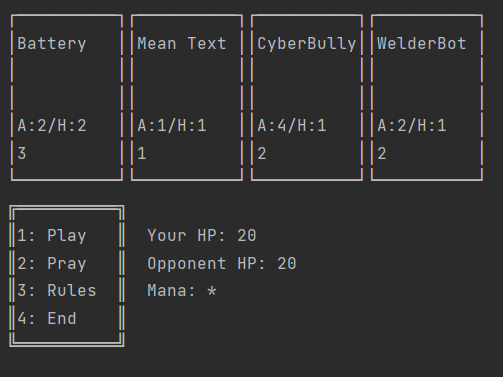

# inscryptionJava
Java Console based version of Card Game Inscryption
Group Final Project in Java OOP Class
 

## OOP Concepts Used
- Model View Controller
- Encapsulation
- Polymorphism
- Inheritance
- Overloading
- Interfaces
- Saving and Reading from a file

### Authors
- [Collin Kite](https://github.com/CollinKite)
- [Platte Clark](https://github.com/PlatteClark)
- [Ryan Larson](https://github.com/AfricanRhino132)
